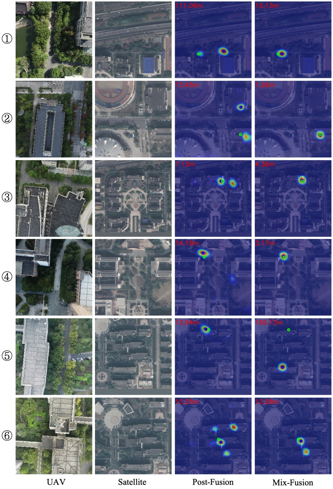

<h1 align="center"> Drone Referring Localization: An Efficient Heterogeneous Spatial Feature Interaction Method For UAV Self-Localization </h1>

This repository contains code and dataset for the paper titled [Drone Referring Localization: An Efficient Heterogeneous Spatial Feature Interaction Method For UAV Self-Localization](https://arxiv.org/pdf/2208.06561).




## News

- **`2024/8/28`**: Our dataset and code are released.

## Table of contents

- [News](#news)
- [Table of contents](#table-of-contents)
- [About Dataset](#about-dataset)
- [Prerequisites](#prerequisites)
- [Installation](#installation)
- [Dataset \& Preparation](#dataset--preparation)
- [Train \& Evaluation](#train--evaluation)
  - [Training and Testing](#training-and-testing)
  - [Evaluation](#evaluation)
- [Supported Methods](#supported-methods)
- [License](#license)
- [Citation](#citation)
- [Related Work](#related-work)

## About Dataset

The dataset split is as follows:
| Subset | UAV-view | Satellite-view | universities |
| -------- | ----- | ---- | ---- |
| Train | 6,768 | 6,768 | 10 |
| test | 2,331 | 27,972 | 4 |

More detailed file structure:

```
├── UL14/
│   ├── train/
│       ├── PlaceName_Height_Index/                  
│           ├── UAV
│               ├── 0.JPG
│           ├── Satellite/              
│               ├── 0.tif
|         ...
│   ├── val/
        ├── PlaceName_Height_Index/
            ├── UAV
│               ├── 0.JPG
│           ├── Satellite/       
│               ├── 0.jpg
|               ├── 1.jpg
|               ├── 2.jpg
|               ...
|               ├── 11.jpg
│           GPS_info.json           /* UAV position in satellite images
|           label.json              /* Supplementary information such as latitude and longitude, mapsize
│   ├── test/                       /* Structure is same as val
```

## Prerequisites

- Python 3.7+
- GPU Memory >= 8G
- Numpy 1.26.0
- Pytorch 2.0.0+cu118
- Torchvision 0.15.0+cu118

## Installation

It is best to use cuda version 11.8 and pytorch version 2.0.0. You can download the corresponding version from this [website](https://download.pytorch.org/whl/torch_stable.html) and install it through `pip install`. Then you can execute the following command to install all dependencies.

```
pip install -r requirments.txt
```

Create the directory for saving the training log and ckpts.

```
mkdir checkpoints
```

## Dataset & Preparation

Download UL14 upon request. You may use the request [Template](docs/request.md).

Additionally, you need to download the pretrain weight of cvt13 from this [link](https://onedrive.live.com/?authkey=%21AMXesxbtKwsdryE&id=56B9F9C97F261712%2115004&cid=56B9F9C97F261712).

**Important:** you need to change the **pretrain_path**, **train_dir**, **val_dir**, **test_dir** in the config file.

## Train & Evaluation

### Training and Testing

You could execute the following command to implement the entire process of training and testing.

```
bash train_test_local.sh
```

The setting of parameters in **train_test_local.sh** can refer to [Get Started](docs/get_start.md).

### Evaluation

The following commands are required to evaluate MA@K and RDS.

```
cd checkpoints/<name>
python test_meter.py --config <name>
```

the `<name>` is the dir name in your training setting, you can find in the `checkpoints/`.

We also provide the baseline checkpoints, [link](https://seunic-my.sharepoint.cn/:u:/g/personal/230238525_seu_edu_cn/Ean86T_8T2xPglxGXuf05xcBgrQNoUtcBrXS97wkGNfAAA?e=Tgk5vm).

```
unzip <file.zip> -d checkpoints
cd checkpoints/baseline
python test.py --test_dir <dataset_root>/test
python test_meter.py --config <name>
```

## License

This project is licensed under the [Apache 2.0 license](https://github.com/Dmmm1997/DenseUAV//blob/main/LICENSE).

## Citation

The following paper uses and reports the result of the baseline model. You may cite it in your paper.

```bibtex
@misc{drl,
      title={Drone Referring Localization: An Efficient Heterogeneous Spatial Feature Interaction Method For UAV Self-Localization}, 
      author={Ming Dai and Enhui Zheng and Zhenhua Feng and Jiahao Chen and Wankou Yang},
      year={2024},
      eprint={2208.06561},
      archivePrefix={arXiv},
      primaryClass={cs.CV},
      url={https://arxiv.org/abs/2208.06561}, 
}
```

## Related Work

- DenseUAV [https://github.com/Dmmm1997/DenseUAV](https://github.com/Dmmm1997/DenseUAV)
- FSRA [https://github.com/Dmmm1997/FSRA](https://github.com/Dmmm1997/FSRA)
